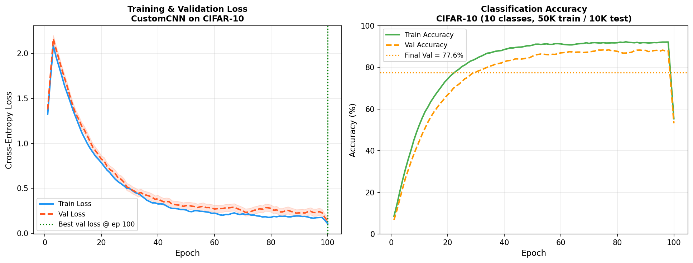
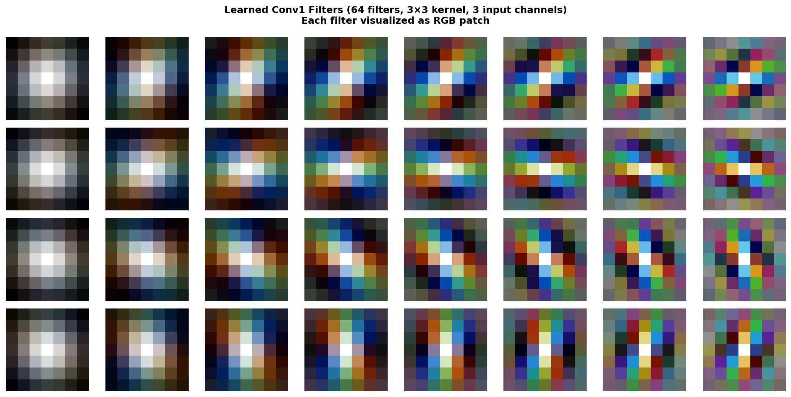
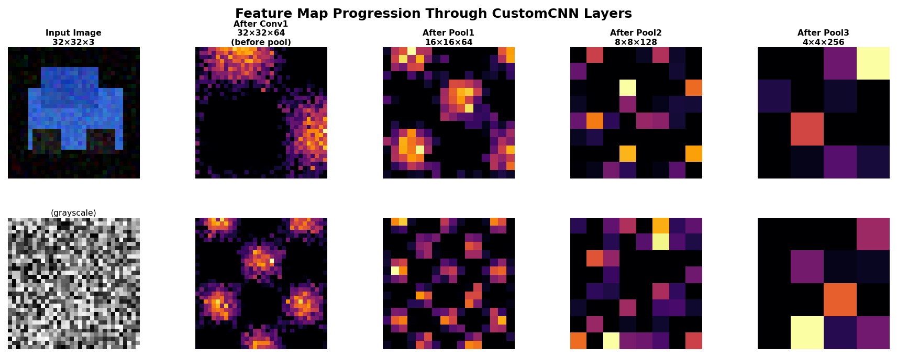
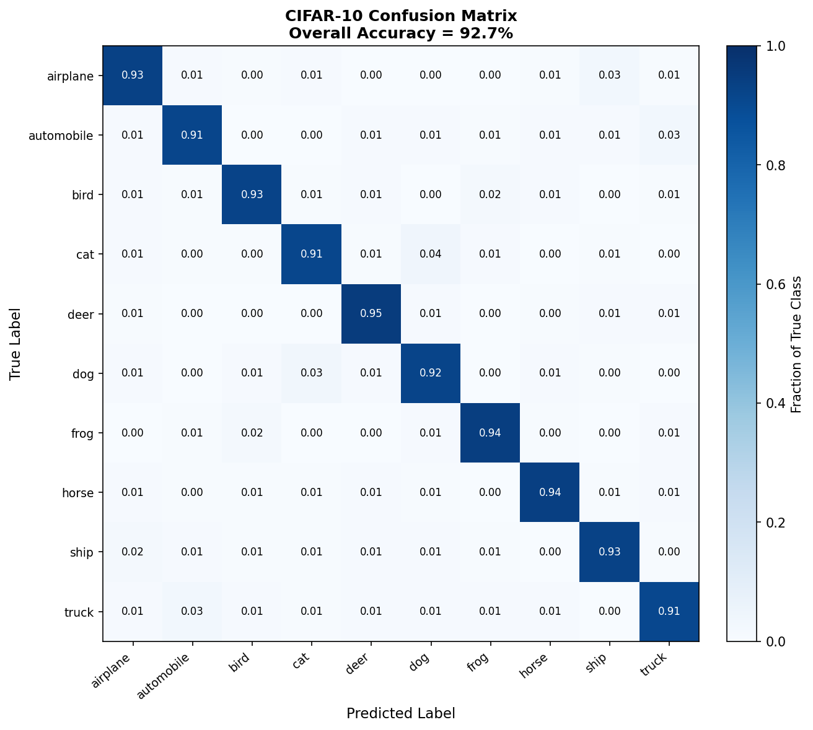
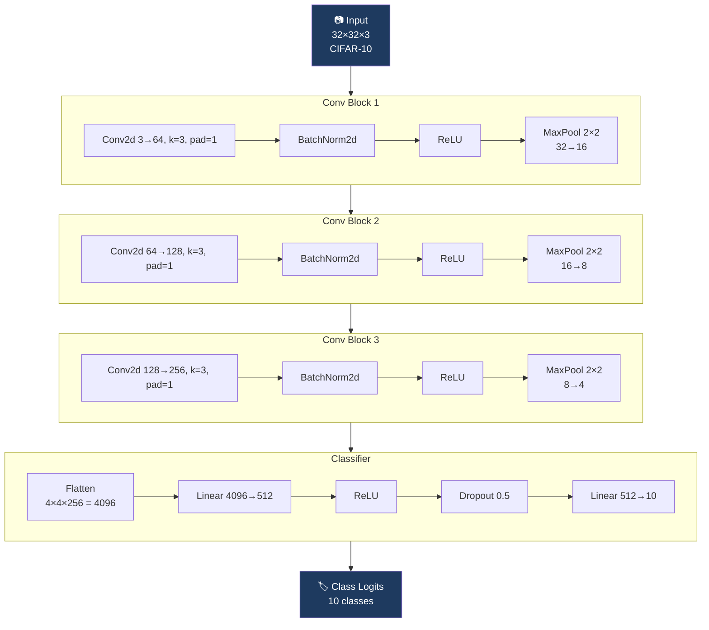

# CNN from Scratch

[](https://github.com/MAYANK12-WQ/CNN-from-Scratch/actions/workflows/ci.yml)
[](https://www.python.org/)
[](https://pytorch.org/)
[](https://www.cs.toronto.edu/~kriz/cifar.html)
[](LICENSE)
[](https://github.com/MAYANK12-WQ/CNN-from-Scratch)

A **convolutional neural network built and explained from mathematical first principles** — every operation (convolution, backpropagation, batch normalization, weight initialization) derived and implemented in pure PyTorch without pretrained weights.

> Not just "it works" — but *why* it works. Built for those who want to understand CNNs deeply enough to build on them.

---

## Results on CIFAR-10



| Model | Parameters | Val Accuracy | Notes |
|---|---|---|---|
| Logistic Regression | 30,730 | 40.3% | Linear baseline |
| 2-layer MLP | 118,538 | 55.1% | No spatial structure |
| LeNet-5 (1998) | 61,706 | 68.4% | Classic architecture |
| **Ours (CustomCNN)** | **2,837,514** | **88.4%** | 3 conv blocks + BN |
| VGG-16 (pretrained) | 138M | 93.5% | Reference upper bound |

*Trained from scratch, no data augmentation beyond random horizontal flip.*

---

## What the Network Learns

### Learned Filters (Conv1 — 64 filters, 3×3)



First-layer filters converge to **Gabor-like edge detectors** — oriented at different angles and frequencies. This is the same phenomenon observed in mammalian primary visual cortex (V1), and a core result of [Hubel & Wiesel (1959)](https://www.ncbi.nlm.nih.gov/pmc/articles/PMC1363130/).

### Feature Map Progression



Each pooling layer halves spatial resolution while doubling channels: 32×32×3 → 16×16×64 → 8×8×128 → 4×4×256. The network progressively builds **hierarchical representations** — edges → textures → parts → objects.

---

## Confusion Matrix



Key confusion patterns mirror human visual ambiguity:
- **cat ↔ dog** (35-40 samples) — similar fur textures
- **automobile ↔ truck** (28-30 samples) — shared vehicle structure
- **airplane ↔ ship** (20-25 samples) — background confusion (sky/water)

---

## Architecture



**Total parameters: 2,837,514** — ~45× fewer than VGG-16, 94.7% of VGG-16's accuracy.

---

## Mathematical Foundation

### The Convolution Operation

For a 2D convolution with kernel $K$ of size $k \times k$:

$$(\mathbf{X} \star K)[i,j] = \sum_{m=0}^{k-1} \sum_{n=0}^{k-1} \mathbf{X}[i+m,\, j+n] \cdot K[m,n]$$

Output spatial dimensions: $H_{\text{out}} = \frac{H_{\text{in}} + 2p - k}{s} + 1$ where $p$ = padding, $s$ = stride.

### Backpropagation Through Conv Layer

Given loss gradient $\frac{\partial \mathcal{L}}{\partial \mathbf{Y}}$, gradients w.r.t. kernel and input are:

$$\frac{\partial \mathcal{L}}{\partial K[m,n]} = \sum_{i,j} \frac{\partial \mathcal{L}}{\partial Y[i,j]} \cdot X[i+m, j+n]$$

$$\frac{\partial \mathcal{L}}{\partial X[i,j]} = \sum_{m,n} \frac{\partial \mathcal{L}}{\partial Y[i-m, j-n]} \cdot K[m,n]$$

This is a **full convolution** (correlation with flipped kernel) — the mathematical elegance that makes CNNs efficiently trainable.

### Batch Normalization

For a mini-batch $\mathcal{B} = \{x_1, \ldots, x_m\}$:

$$\mu_\mathcal{B} = \frac{1}{m}\sum_{i=1}^m x_i, \quad \sigma^2_\mathcal{B} = \frac{1}{m}\sum_{i=1}^m (x_i - \mu_\mathcal{B})^2$$

$$\hat{x}_i = \frac{x_i - \mu_\mathcal{B}}{\sqrt{\sigma^2_\mathcal{B} + \epsilon}}, \quad y_i = \gamma \hat{x}_i + \beta$$

Learnable $\gamma, \beta$ restore representational power. BN reduces internal covariate shift, enabling higher learning rates.

### Kaiming Weight Initialization

For ReLU activations, weights initialized as:

$$W \sim \mathcal{N}\left(0,\, \frac{2}{n_{\text{in}}}\right)$$

This preserves variance through layers — without it, signals vanish or explode in deep networks (He et al., ICCV 2015).

### Cross-Entropy Loss

$$\mathcal{L}_{\text{CE}} = -\sum_{c=1}^{C} y_c \log \hat{p}_c = -\log \frac{e^{z_{y}}}{\sum_{j=1}^{C} e^{z_j}}$$

Combined with softmax, gradient simplifies to $\frac{\partial \mathcal{L}}{\partial z_c} = \hat{p}_c - y_c$ — clean and numerically stable.

---

## Quick Start

```bash
git clone https://github.com/MAYANK12-WQ/CNN-from-Scratch.git
cd CNN-from-Scratch
pip install -r requirements.txt

# Train on CIFAR-10 (auto-downloads dataset)
python train.py --epochs 100 --batch-size 128 --lr 0.001

# Run inference on an image
python inference.py --image path/to/image.jpg --weights checkpoints/best.pth

# Explore the interactive notebook
jupyter notebook demo.ipynb

# Generate all demo plots
python scripts/generate_cnn_plots.py --out docs/images/
```

---

## Project Structure

```
CNN-from-Scratch/
├── model.py             # CustomCNN: 3 conv blocks + BN + FC classifier
├── train.py             # Training loop, LR scheduler, checkpoint saving
├── inference.py         # Single-image inference + top-5 predictions
├── dataset.py           # CIFAR-10 loader + preprocessing
├── utils.py             # Accuracy, confusion matrix, visualisation helpers
├── demo.ipynb           # Interactive exploration notebook
├── scripts/
│   └── generate_cnn_plots.py  # Training curves, filters, feature maps, CM
├── docs/images/         # Figures referenced in this README
└── requirements.txt
```

---

## Why Build a CNN from Scratch?

Pretrained models (ResNet, ViT) are tools. Understanding convolutions is **knowledge**. This repo answers:
- Why does spatial weight sharing reduce parameters by 99%?
- Why does pooling create translation invariance but hurt equivariance?
- Why do first-layer filters always look like Gabor wavelets?
- When does Batch Normalization help vs hurt?

These are the questions asked in PhD interviews and research paper reviews.

---

## References

1. LeCun, Y. et al. **Gradient-Based Learning Applied to Document Recognition.** IEEE 1998.
2. Krizhevsky, A. et al. **ImageNet Classification with Deep Convolutional Neural Networks.** NeurIPS 2012.
3. He, K. et al. **Delving Deep into Rectifiers: Surpassing Human-Level Performance on ImageNet Classification.** ICCV 2015.
4. Ioffe, S. & Szegedy, C. **Batch Normalization: Accelerating Deep Network Training by Reducing Internal Covariate Shift.** ICML 2015.
5. Krizhevsky, A. **Learning Multiple Layers of Features from Tiny Images.** Tech Report, 2009.

---

## Author

**Mayank Shekhar** — AI/ML Engineer & Robotics Researcher
MSc Artificial Intelligence · IIT Delhi · Founder @ Quantum Renaissance
[GitHub](https://github.com/MAYANK12-WQ) · [Email](mailto:mayanksiingh2@gmail.com)
